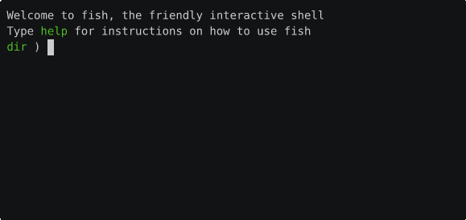

# CLISeer

Press `Ctrl+Space` in your terminal to activate AI powered command line suggestions.



## Features

* Context-aware command suggestions
* Lightweight, only use CLISeer when you want it. Doesn't clutter up your terminal
* Quick step

## Installation

### Option 1: Using fisher

``` fish
fisher install cliseer/cliseer-fish
```

### Option 2: Manual Installation
``` fish
git clone https://github.com/cliseer/cliseer-fish
fish install.fish
```

Both installation methods will prompt you to install required dependencies.

## Configuration

Keybindings are configured by `~/.config/fish/functions/cliseer_suggestions.fish`
Other settings are configured by `~/.config/cliseer/settings.cfg`

### AI Providers

By default, CLISeer uses the `cliseer` provider, which offers a rate-limited number of completions through our hosted server. You can configure these alternate providers


| Provider | Environment Variable | Description |
|----------|---------------------|-------------|
| `openai` | `OPENAI_API_KEY` | Uses OpenAI's models for suggestions |
| `anthropic` | `ANTHROPIC_API_KEY` | Uses Anthropic's Claude models |


## Dependencies

- [fzf](https://github.com/junegunn/fzf) - Displays and navigates command suggestions
- [cliprophesy](https://github.com/cliseer/cliprophesy) - Backend API client, install with `pip install cliprophesy`

## Privacy Notice

**Important:** When invoked CLISeer sends the following data to the configured AI provider when

- Your current and recent Fish shell commands (~20 lines)
- Operating system and shell information
- Previous command exit codes

This data may inadvertently include sensitive information such as API keys or passwords if present in your history. Use with care

## Support and Contribution

- GitHub: [https://github.com/cliseer/cliseer-fish](https://github.com/cliseer/cliseer-fish)
- Issues: [https://github.com/cliseer/cliseer-fish/issues](https://github.com/cliseer/cliseer-fish/issues)
